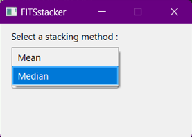

# FITSstacker

<a name="readme-top"></a>

<!-- TABLE OF CONTENTS -->
<details>
  <summary>Table of Contents</summary>
  <ol>
    <li>
      <a href="#installation">Installation</a>
      <ul>
        <li><a href="#executable">Executable</a></li>
        <li><a href="#source">Source</a></li>
      </ul>
    </li>
    <li><a href="#features">Features</a></li>
    <li><a href="#usage">Usage</a></li>
    <li><a href="#contact">Contact</a></li>
  </ol>
</details>

<!-- INSTALLATION -->
## Installation

<!-- EXECUTABLE STEPS -->
### Executable

Download and launch **setup.msi**. A shortcut will appear in your Desktop. The software is now installed and ready to be used.

<!-- SOURCE STEPS -->
### Source

**WARNING : This project requires MSVC compiler as it uses Visual Studio library files (*.lib).**
1. Clone the repository
   ```bash
   git clone https://github.com/HoussamCzn/FITSstacker.git
   ```

2. Open the ``.sln`` file if you're using Visual Studio or the ``.pro`` file for QtCreator users.

<!-- FEATURES -->
## Features

- [X] Mean
- [X] Median
- [ ] Outliers rejection

<!-- USAGE EXAMPLE -->
## Usage

- Select your stacking method by clicking the one you want to use and confirm your choice.
>

- Select the files you want to stack, ***at least 2 files***.
>

- Choose the name and the location of the output file.
>

Those 3 small steps will generate a file containing your stacked data.
>

You can view the result by using an image manipulation program such as GIMP.
>

<!-- CONTACT -->
## Contact

Houssam CUMZAIN - cumzain.houssam@gmail.com\
Nathan DEVIENNE - nathan.devienne.pro@gmail.com\
Jude KABEYA - judek9392@gmail.com

Project Link: [https://github.com/HoussamCzn/FITSstacker.git](https://github.com/HoussamCzn/FITSstacker.git)